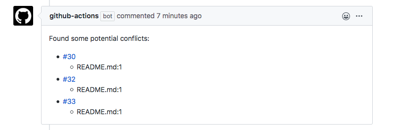

# conflibot

:warning: Development in progress -- interfaces and behavior may change until v1 gets released.

Post a warning if a Pull Request will conflict with another Pull Request when they get merged.



## Configuration

```yaml
name: conflibot
on: pull_request

jobs:
  conflibot:
    runs-on: ubuntu-latest
    steps:
      - uses: actions/checkout@v2
      - name: Post conflict warnings
        uses: wktk/conflibot@master
        with:
          github-token: ${{ secrets.GITHUB_TOKEN }}
```
