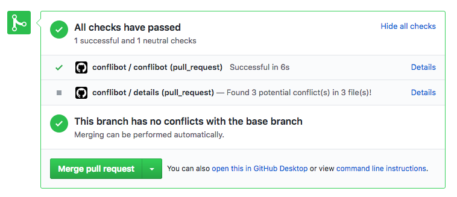
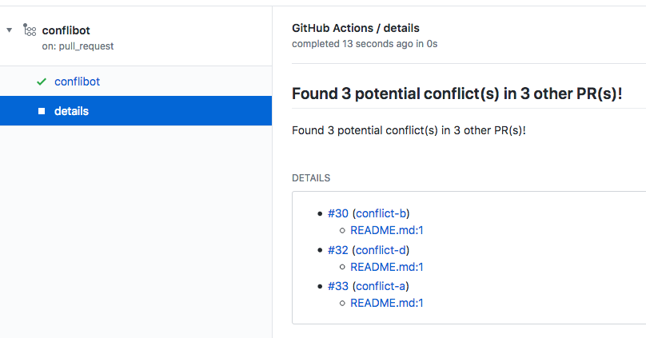

# conflibot

Check and warn if a Pull Request will conflict with another Pull Request when they get merged.

For every open PR that targets the same base branch, conflibot checks whether its changes still apply cleanly once the current PR is merged, and reports the result as a `conflibot/details` check run with links to the conflicting lines.

## Configuration

```yaml
name: conflibot
on: pull_request_target

permissions:
  checks: write
  contents: read
  pull-requests: read

jobs:
  conflibot:
    runs-on: ubuntu-latest
    steps:
      - uses: actions/checkout@v5
      - name: Warn potential conflicts
        uses: wktk/conflibot@v1
        with:
          github-token: ${{ secrets.GITHUB_TOKEN }}
          exclude: |
            yarn.lock
            **/*.bin
```

The `pull_request_target` event is used so the check can be reported with write permissions even for PRs from forks. conflibot only reads PR contents through `refs/pull/*/head`; it never executes code from the PR.

### Inputs

| Name | Default | Description |
| ---- | ------- | ----------- |
| `github-token` | (required) | GitHub API token with write access to checks |
| `exclude` | | Ignored path patterns in **newline-separated** glob format |
| `fail-on-conflict` | `false` | Report the check as `failure` and fail the step when potential conflicts are found, instead of a `neutral` check |
| `max-retries` | `5` | How many times to poll for GitHub's test merge commit before giving up |
| `retry-interval` | `1` | Seconds to wait between test merge commit polls |

### Outputs

| Name | Description |
| ---- | ----------- |
| `conflicts` | Potential conflicts as a JSON array of `{number, headRef, headSha, files}` objects; `[]` when none are found |

The output can feed follow-up steps, for example posting a comment:

```yaml
      - name: Warn potential conflicts
        id: conflibot
        uses: wktk/conflibot@v1
        with:
          github-token: ${{ secrets.GITHUB_TOKEN }}
      - name: Show conflicts
        if: ${{ steps.conflibot.outputs.conflicts != '[]' }}
        run: echo '${{ steps.conflibot.outputs.conflicts }}'
```

## How it works

1. Wait until GitHub finishes computing the test merge commit for the current PR; skip with a neutral check if the PR is not mergeable.
2. List every other open PR with the same base branch (paginated, so large repositories are fully covered).
3. Fetch `refs/pull/<n>/head` for all of them (works for forks too), check out the current PR's head, and merge the base branch into it.
4. For each other PR, generate its patch against the base and test whether it still applies with `git apply --check`. Files that fail to apply are reported as potential conflicts.

## Development

```console
$ yarn install
$ yarn test        # unit tests (vitest)
$ yarn lint        # eslint
$ yarn typecheck   # tsc --noEmit
$ yarn package     # bundle dist/index.js with ncc (commit the result)
```

## Screenshots



